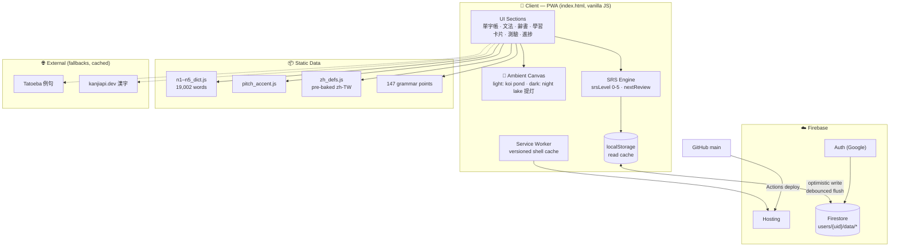
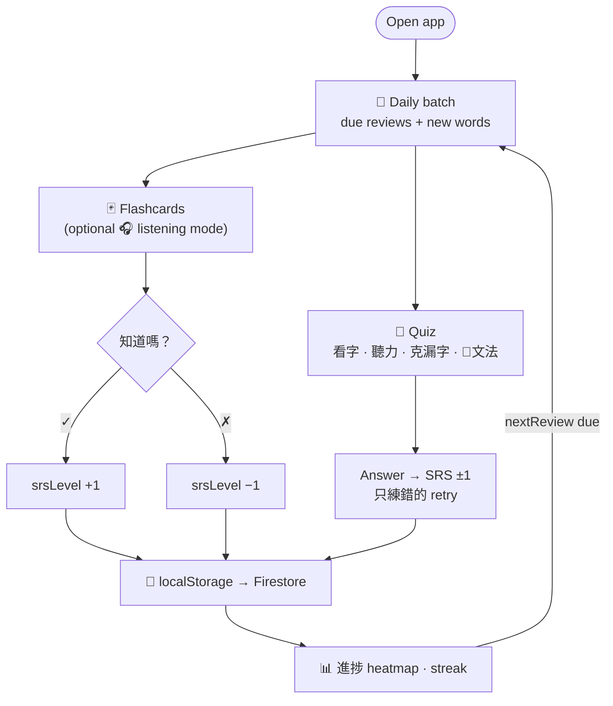

# 日本語深層學習アプリ · Japanese Deep Learning

A single-file PWA for learning Japanese vocabulary and grammar (JLPT N5–N1),
with SRS flashcards, four quiz modes, a JMdict dictionary, pitch accents,
and cloud sync — wrapped in a Crystal Clear Lake theme with swimming koi
(light) and floating lanterns on a night lake (dark).

**Live**: https://japanese-b4d88.web.app

## Features

- 🃏 **SRS flashcards** — daily word batches, listening mode (hear → recall), status tracking new→learning→review→mastered
- 🧪 **Quiz** — 看字 / 聽力 / 克漏字 / 文法 (grammar cloze) modes with 只練錯的 retry
- 📖 **文法** — 147 grammar points with structure, explanation, examples in a detail modal
- 🔍 **辭書** — 19,002-word JMdict dictionary with conjugation tables, pitch accents, 漢字分解 (kanji breakdown), collocations, clickable example sentences
- 📊 **進捗** — activity heatmap, streaks, accuracy stats
- ☁️ **Sync** — Google sign-in, Firestore per-user data, offline-first
- 🌊 **Theme** — animated koi pond (light) / lantern night lake (dark), rendered on canvas

## System Architecture

Full document: [docs/System-Architecture.md](docs/System-Architecture.md)



## Workflow

Full document: [docs/Workflow.md](docs/Workflow.md)



## Development

```bash
# no build step — serve the folder and open index.html
npx serve .

# deploy (automatic on push to main via GitHub Actions)
firebase deploy --only hosting

# rebuild pre-baked translations after dict data changes
python _dev/pretranslate.py
```

Docs: [Database Schema](docs/Database-Schema.md) · [UX Improvements](docs/UX-Improvements.md)
