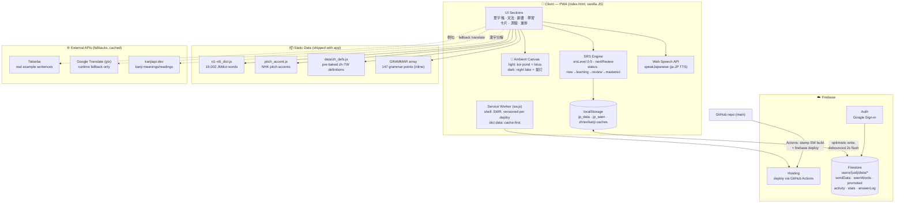

# System Architecture

日本語深層學習アプリ is a single-file PWA (`index.html`) served by Firebase Hosting,
with per-user study data in Firestore and all dictionary data shipped as static files.

## Key design decisions

| Decision | Rationale |
|---|---|
| Single `index.html` (~19k lines) | Zero build step; deploy = copy file |
| Dictionary as static JS files | Free, offline-capable, no API quota |
| Pre-baked zh-TW translations (`zh_defs.js`) | Removes runtime dependency on the unofficial Google Translate endpoint |
| localStorage = read cache, Firestore = source of truth | Instant reads, optimistic writes, offline resilience |
| Firestore rules: `users/{uid}` self-access only | Web API key is public by design; rules are the security boundary |
| SW shell cache stamped with commit SHA | Every deploy auto-reloads open tabs; no stale UI |
