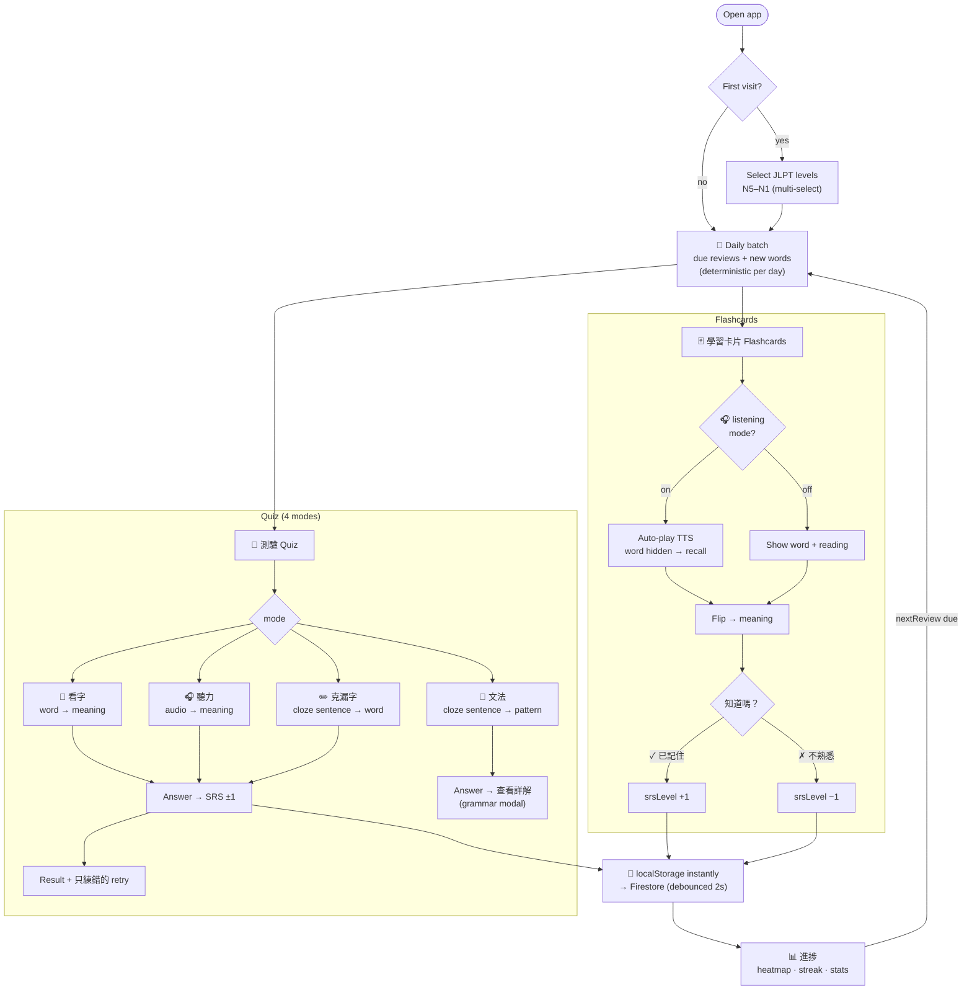
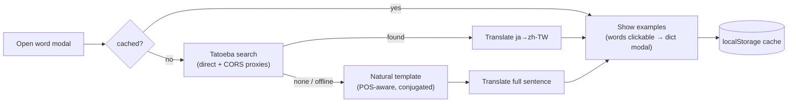

# Study Workflow

The daily loop: pick JLPT levels once, then study the same day-batch of words
across flashcards and quizzes. Every answer updates the SRS schedule and syncs
to Firestore.

## Example sentence pipeline (dict modal 例句)

